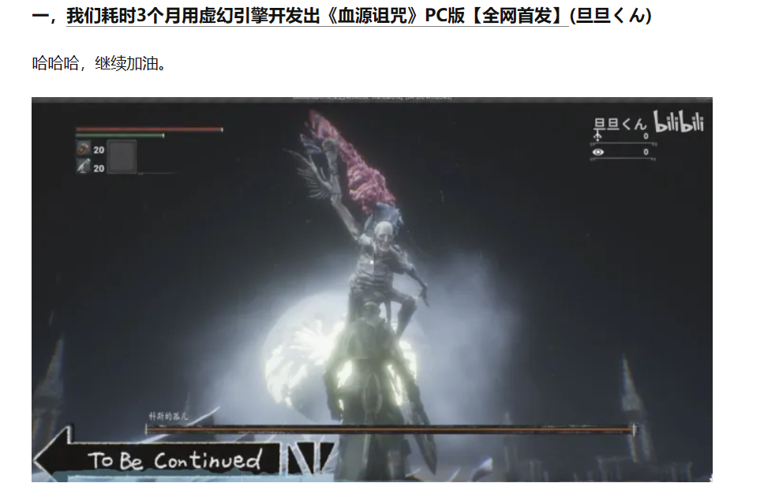
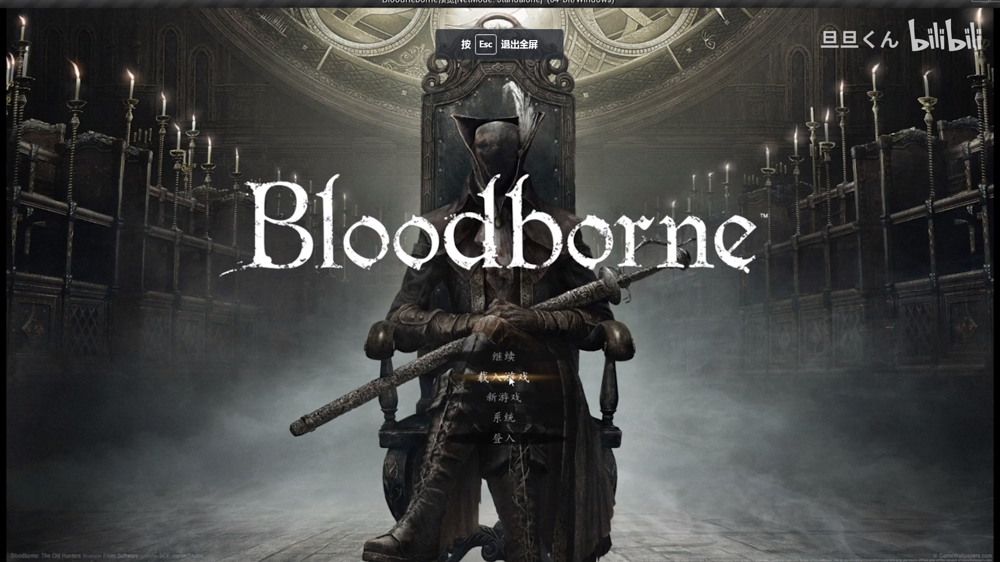
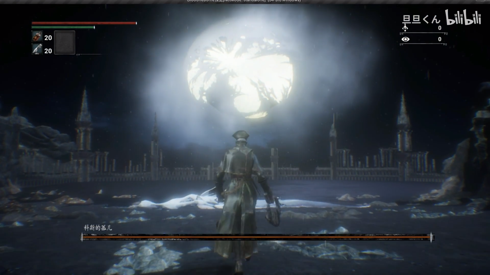
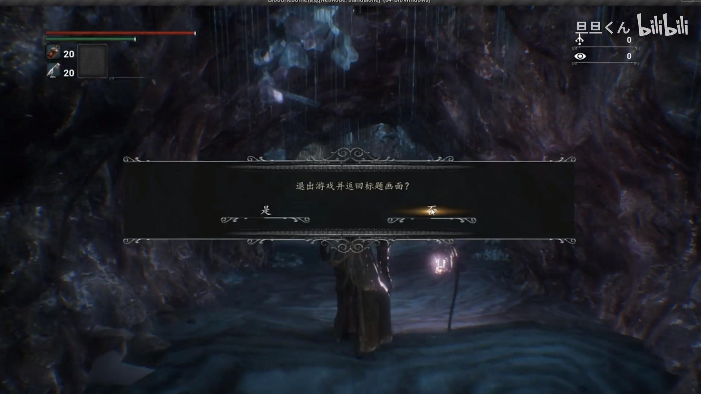
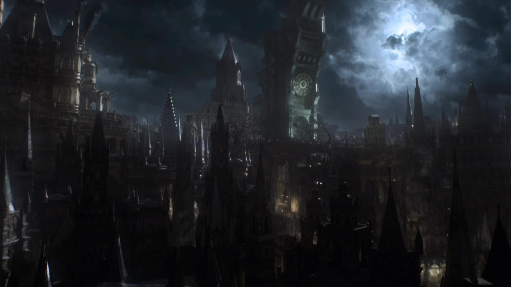
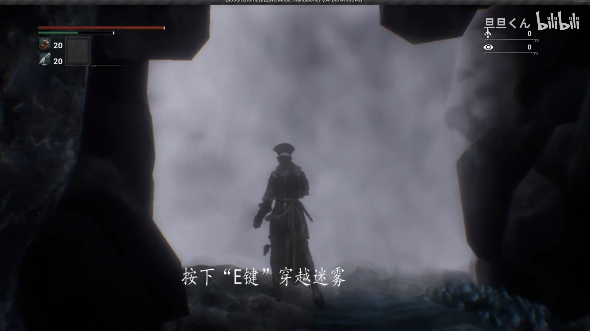
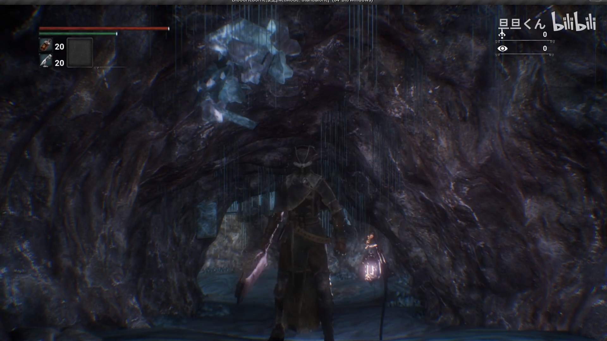
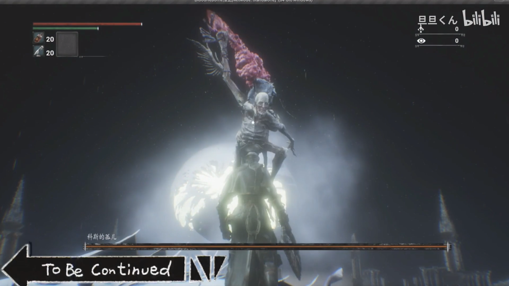
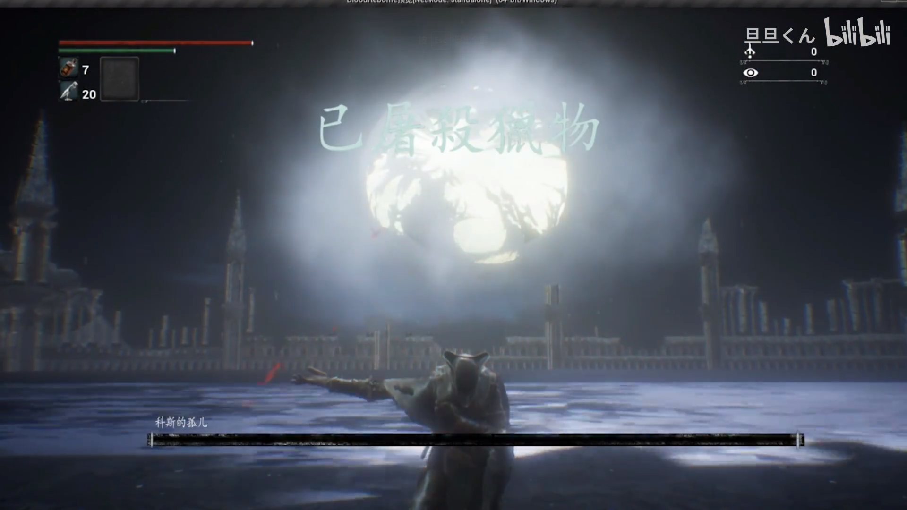
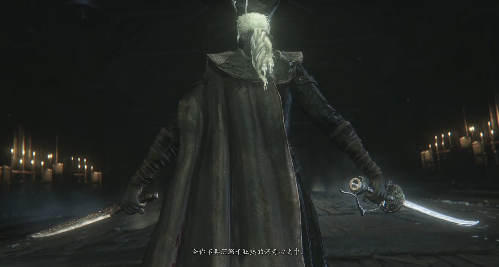

# 血缘诅咒PC版复刻

**这个我们大概3个人的团队做了这样一场科斯的孤儿BOSS战**，因为非常喜欢血缘诅咒这款游戏又苦于血缘诅咒没有PC版，仅出于**学习技术和个人爱好**为目的制作这个魂类游戏。

说明：目前的项目还不完整，暂且不开放试玩 **项目只是用来学习虚幻4的相关技术**，并非用于商业目的

## 负责的技术部分：
  1.采用C++和蓝图编程
   
  2.参与实现对游戏中BOSS战AI战斗的设计与制作，涉及到的技术有(寻路网格体、行为树、黑板环境、查询系统（EQS）、Pawn感知PawnSensing & AI感知系统AIPerception、调试工具)
   
  3.完成玩家角色Controller的设计和逻辑的实现
   

## 描述：

这是一款基于UE4开发复刻血缘诅咒的Combat System的游戏，完成对科斯的孤儿BOSS战的复刻

#### 成绩：

荣登虚幻官方的游戏周报：[虚幻周报20210414 | 将有大事要发生！ - 知乎 (zhihu.com)](https://zhuanlan.zhihu.com/p/364651384)

#### 视频效果：

[我们耗时3个月用虚幻引擎开发出《血源诅咒》PC版【全网首发】_哔哩哔哩_bilibili](https://www.bilibili.com/video/BV1K64y1S7e4/?vd_source=4557bf5dbac04d734a4b28b0daae5c2f)

## 图片展示：

##### 游戏UI界面展示：

##### 游戏场景：

.jpg)

##### 游戏互动:

****

##### 人物复活：

##### 战斗场景：

